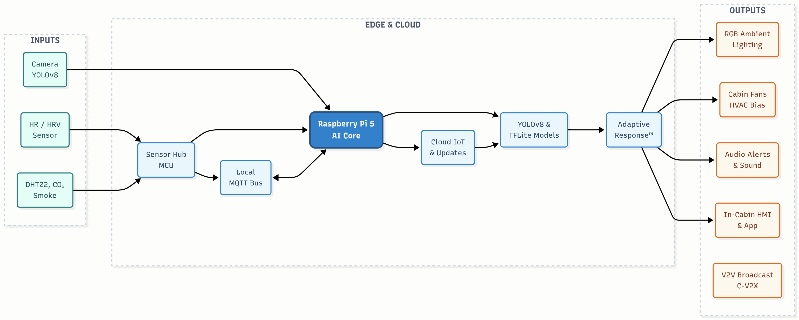
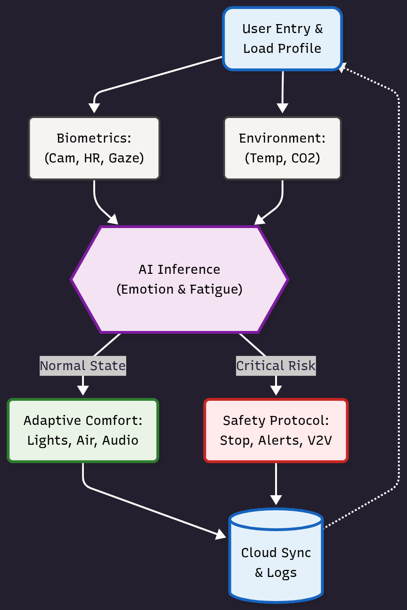
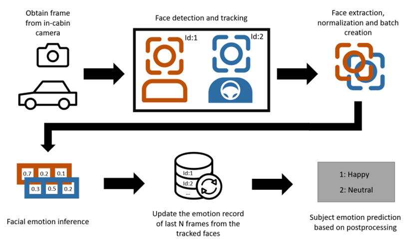
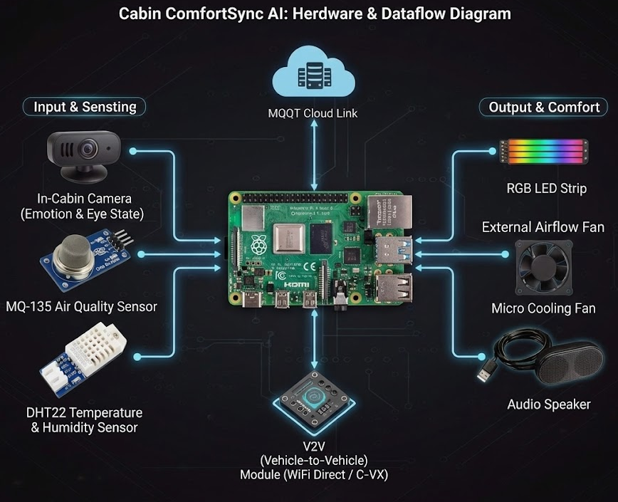

# ComfortSync AI


> An intelligent, adaptive in-cabin system for next-generation smart and autonomous vehicles.

ComfortSync AI is a sophisticated platform that combines sensor-based environment monitoring, biometric feedback, and AI-driven emotion recognition to optimize passenger comfort and safety in real-time. The system personalizes the cabin environment for each occupant, responds to emotional and physiological changes, and can autonomously trigger safety mechanisms when required.

## 🌟 System Vision

The primary vision of the ComfortSync AI system is to develop an intelligent vehicle cabin that:

1.  **Understands Individual Passengers**: Through biometrics, behavioral cues, and learned preferences.
2.  **Adapts Continuously**: Adjusts environmental conditions for comfort and emotional balance.
3.  **Detects and Intervenes**: Identifies drowsiness, stress, or emergency states and acts automatically.
4.  **Communicates for Safety**: Shares cabin safety information with nearby vehicles for coordinated behavior.
5.  **Integrates Advanced Technologies**: Demonstrates capabilities across IoT, embedded systems, machine learning, and software architecture.

## ✨ Key Features

### Personalized Cabin Experience
The system builds and applies individualized comfort profiles using:
*   **Heart-rate and stress metrics** from wearable devices.
*   **Smartphone-based user preference profiles**.
*   **Facial expression and voice-tone recognition** for mood analysis.
*   **Historical data** stored and synchronized via the cloud.

### Dynamic Environmental Adaptation
Control of:
*   **Lighting**: Adjusts color and intensity to match the passenger's mood or the time of day.
*   **Airflow & Temperature**: Manages fans and actuators to maintain a comfortable climate.
*   **Audio**: Plays background audio and sounds to create a relaxing or energizing atmosphere.

### Emotion and Fatigue Detection
A camera-based AI module monitors facial expressions, eye dynamics, and head posture, applying:
*   **Facial Emotion Classification**: Using TensorFlow Lite to recognize emotions like happiness, sadness, and anger.
*   **Drowsiness Detection**: Through eye-blink frequency and gaze monitoring to prevent accidents.
*   **Stress Analysis**: Via heart-rate variability trends to identify and mitigate passenger stress.

### Environmental and Biometric Sensing
Sensor modules include:
*   **DHT22**: For precise temperature and humidity readings.
*   **CO2 and Air-Quality Sensors**: To ensure a healthy and safe breathing environment.
*   **Wearable Sensors**: For real-time heart-rate and stress monitoring.
*   **Safety Sensors**: To detect fire, smoke, and gas leaks.

### Cabin Safety Automation
The system automatically responds to hazardous in-cabin events such as:
*   **Driver microsleep or attention loss**.
*   **Smoke, heat, or gas detection**.
*   **Rapid drop in passenger vitals**.

### Inter-Vehicle Safety Communication (V2V)
Vehicles equipped with the system can communicate passenger safety-relevant data via Wi-Fi Direct or C-V2X, enabling a cooperative safety network.

## 🏗️ System Architecture

The system is designed with a layered architecture to ensure modularity and scalability. This separation of concerns allows for easier development, testing, and maintenance.


*A high-level overview of the system's components and their interactions.*

### Technology Stack

*   **Hardware**: Raspberry Pi 5, Camera Module, Environmental Sensors (DHT22, etc.), Biometric Input Devices, LEDs, Cooling Fans.
*   **Software**: Python, OpenCV, TensorFlow Lite, MQTT, Embedded Control Scripts.
*   **Networking**: Wi-Fi Direct / MQTT Broker, optional C-V2X integration.
*   **Cloud**: Firebase or AWS IoT for profile storage and real-time logs.
*   **Dashboard**: A Flutter-based passenger app and a Grafana/ThingsBoard monitoring dashboard.

## ⚙️ System Workflow

The system operates through a series of interconnected workflows, from passenger detection to emergency response.

### General Flow

*The general workflow of the ComfortSync AI system, from data collection to actuation.*

### Emotion Detection Flow

*The process of detecting and classifying emotions from the camera feed.*

## 🛠️ Hardware Setup

A brief overview of the hardware configuration, showcasing the placement of sensors and actuators within the cabin.


*The physical setup of the hardware components, including the Raspberry Pi, camera, and sensors.*

## 🚀 Getting Started

### Prerequisites

*   Python 3.9+
*   Raspberry Pi 5
*   A running MQTT Broker
*   The required hardware components (camera, sensors, etc.)

### Installation

1.  Clone the repository:
    ```bash
    git clone https://github.com/your-username/Comfort_Sync_AI.git
    ```
2.  Install the required packages:
    ```bash
    pip install -r requirements.txt
    ```

## 🏃‍♂️ Usage

The system consists of multiple components that need to be run separately.

### 1. MQTT Broker

Ensure your MQTT broker is running and accessible on your network.

### 2. Raspberry Pi Controller

Run the main controller on your Raspberry Pi. This script is the core of the system, managing sensors, actuators, and decision-making.
```bash
python src/rpi_hardware/main_controller.py
```

### 3. Vision System

Run the emotion detection and publisher on your laptop or a dedicated computer with a camera. This script captures video, analyzes it for emotions, and publishes the results to the MQTT broker.
```bash
python src/vision_models/emotion_publisher.py
```

### 4. Dashboard

Launch the dashboard application to monitor the system's status and sensor readings in real-time.
```bash
python dashboard/app.py
```

## 📈 Project Impact

ComfortSync AI introduces a new layer of intelligence into the mobility ecosystem by merging:

*   **Human-Emotion-Aware Computing**: Creating a more empathetic and responsive in-cabin experience.
*   **IoT-Based Environmental Automation**: Seamlessly adjusting the environment for optimal comfort.
*   **Real-Time Safety Automation**: Proactively preventing accidents and responding to emergencies.
*   **Cooperative Vehicle-to-Vehicle Intelligence**: Building a network of safer, more aware vehicles.

This project demonstrates an advanced integration of engineering disciplines and contributes to the future of human-centric autonomous mobility environments.

## 📄 License

This project is licensed under the MIT License. See the [LICENSE](LICENSE) file for details.